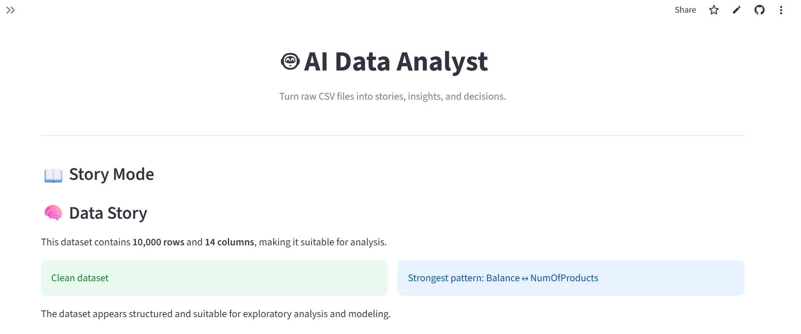
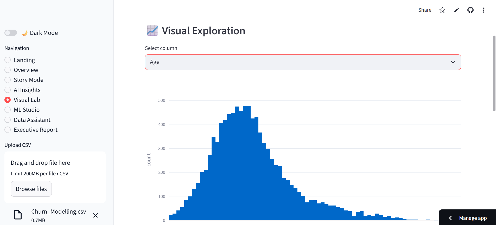
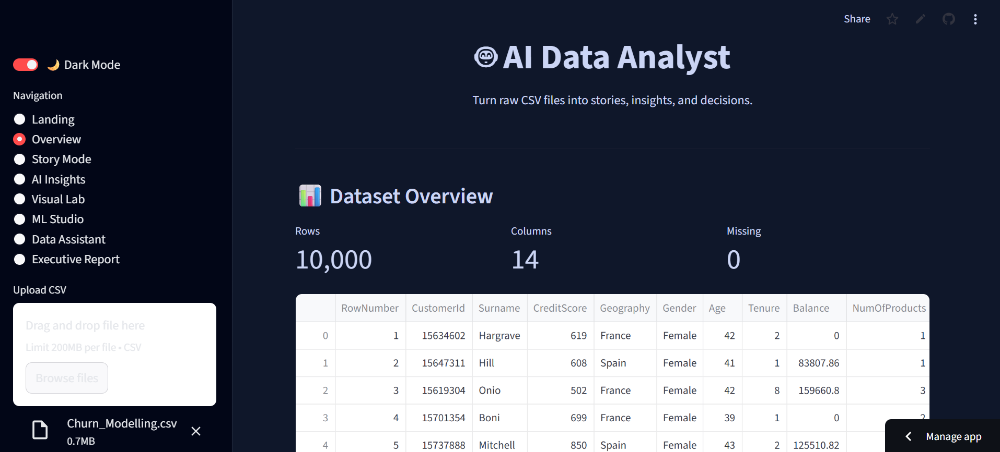
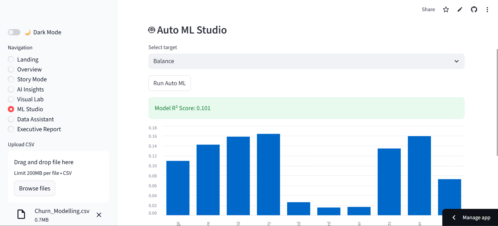
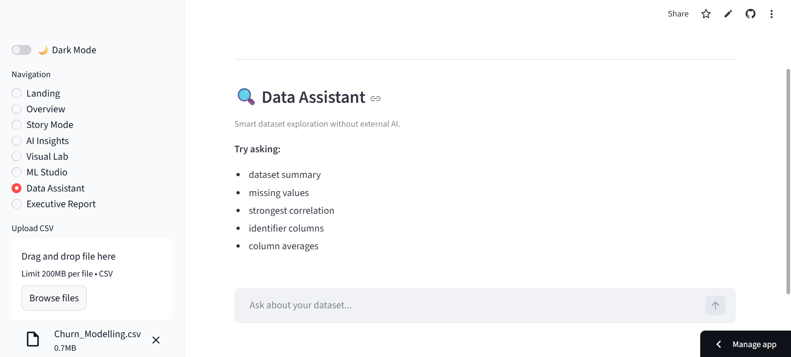

# 🤖 AI Data Analyst: End-to-End Intelligence Suite

A production-ready Streamlit application that transforms raw CSV datasets into narrative insights, interactive visualizations, machine learning predictions, and executive-level PDF reports.

Built to bridge the gap between static Jupyter Notebooks and deployable data products.

---

## 🚀 Live Demo
**View the app here:** [ai-data-analyst-123.streamlit.app](https://ai-data-analyst-123.streamlit.app/)

---

## ✨ Key Features

* **📊 Instant Data Profiling:** Rapid overview of dataset health, including shape, types, and missing values.
* **📖 Story Mode:** Narrative-driven insights that explain "the story" behind the numbers.
* **🧠 Automated Insights:** AI-style detection of patterns, correlations, and anomalies.
* **📈 Visual Lab:** Interactive Plotly-based histograms, scatter plots, and heatmaps.
* **🤖 One-Click Auto-ML:** Train and evaluate machine learning models without writing a line of code.
* **🔍 Smart Assistant:** Query your dataset for specific answers on the fly.
* **📄 Executive Reporting:** Generate and download professional PDF summaries of your analysis.
* **⚡ High Performance:** Modular architecture optimized for speed and scalability.

---

## 📸 Project Showroom

| **Landing & Upload** | **Story Mode Insights** |
| :---: | :---: |
|  |  |
| **Visual Lab** | **Dark Mode** |
|  |  |
| **ML Studio** | **Data Assistant** |
|  |  |

---

## 🛠 Tech Stack

| Category | Tools |
| :--- | :--- |
| **Frontend/App** | Python, Streamlit |
| **Data Processing** | Pandas, NumPy |
| **Visualization** | Plotly |
| **Machine Learning** | Scikit-learn |
| **Reporting** | ReportLab (PDF Engine) |
| **Deployment** | Streamlit Cloud |

---

## ⚙️ Installation & Setup

1.  **Clone the Repository**
    ```bash
    git clone [https://github.com/MeghanaUllas20/ai-data-analyst](https://github.com/MeghanaUllas20/ai-data-analyst)
    cd ai-data-analyst
    ```

2.  **Install Dependencies**
    ```bash
    pip install -r requirements.txt
    ```

3.  **Launch the App**
    ```bash
    streamlit run app.py
    ```

---

## 📂 Project Architecture

The project follows a modular design pattern for easy maintenance and feature expansion:

```bash
ai-data-analyst/
│
├── app.py                 # Main Streamlit app
├── requirements.txt
│
├── modules/
│   ├── ai_engine.py       # Insight detection engine
│   ├── storytelling.py    # Narrative generator
│   ├── ml_lab.py          # AutoML module
│   └── pdf_engine.py      # Executive report generator
│
└── images/
    ├── landing.png
    ├── story_mode.png
    ├── visual_lab.png
    └── dark_mode.png
```

## 🎯 Key Highlights

* **End-to-End Build:** A fully integrated data product from ingestion to visualization.
* **Modular Architecture:** Developed using reusable components for scalability and maintainability.
* **Portfolio-Ready:** Designed for immediate deployment with a professional user experience.
* **Automated Executive Reporting:** Includes a pipeline for generating high-level business insights.
* **SaaS-Inspired UI:** Features a clean, modern dashboard design modeled after real-world analytics tools.
* **Production Mindset:** Focuses on code quality, structure, and usability over raw scripts.

## 🚀 Future Improvements

- [ ] **Expanded ML Support:** Integration for additional machine learning models.
- [ ] **Advanced Analytics:** Interactive dashboards with custom filters and drill-down capabilities.
- [ ] **LLM Integration:** Connecting real LLMs (OpenAI or local instances) for natural language insights.
- [ ] **Multi-Format Export:** Ability to export reports via PPT and Excel.
- [ ] **User Management:** Support for user accounts and saved report configurations.
- [ ] **Cloud Readiness:** Containerization via Docker and deployment to cloud platforms.

## 👩‍💻 Author

**Meghana U**

* **GitHub:** [MeghanaUllas20](https://github.com/MeghanaUllas20)

---
*Built with passion for data and product design.*
